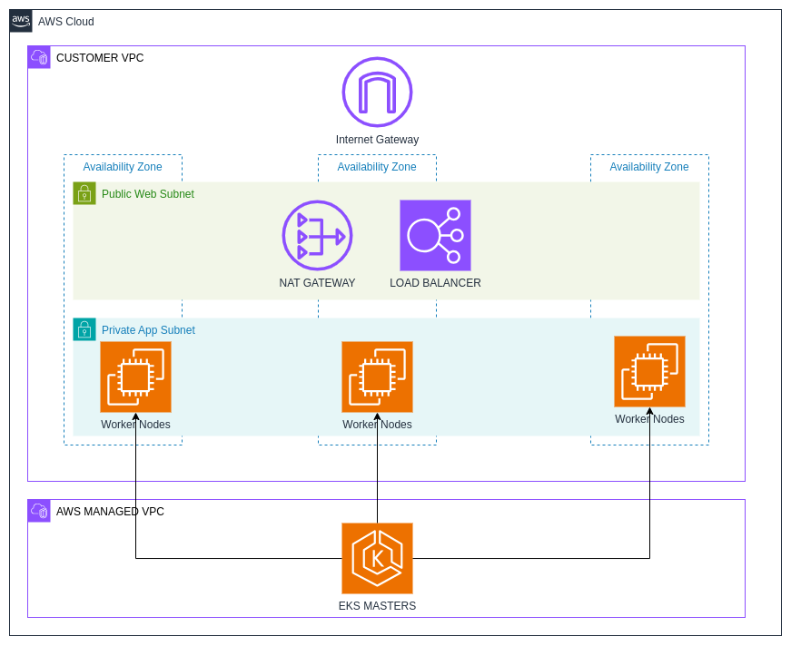
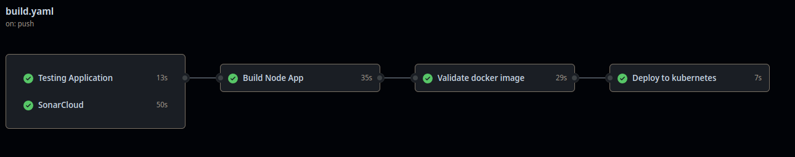
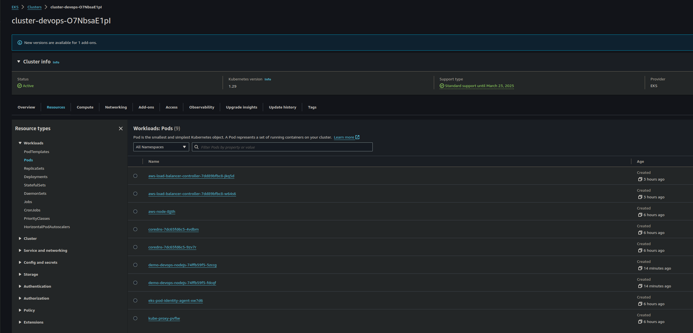
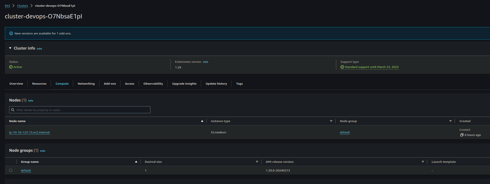
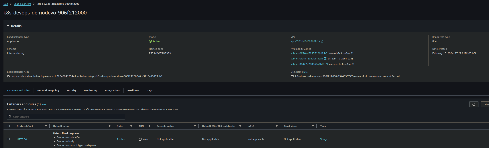

# Demo Devops NodeJs

This is a simple application to be used in the technical test of DevOps.

## Getting Started

### Prerequisites

- Node.js 18.15.0

### Installation

Clone this repo.

```bash
git clone https://bitbucket.org/devsu/demo-devops-nodejs.git
```

Install dependencies.

```bash
npm i
```

### Database

The database is generated as a file in the main path when the project is first run, and its name is `dev.sqlite`.

Consider giving access permissions to the file for proper functioning.

## Usage

To run tests you can use this command.

```bash
npm run test
```

To run locally the project you can use this command.

```bash
npm run start
```

Open http://localhost:8000/api/users with your browser to see the result.

### Features

These services can perform,

#### Create User

To create a user, the endpoint **/api/users** must be consumed with the following parameters:

```bash
  Method: POST
```

```json
{
    "dni": "dni",
    "name": "name"
}
```

If the response is successful, the service will return an HTTP Status 200 and a message with the following structure:

```json
{
    "id": 1,
    "dni": "dni",
    "name": "name"
}
```

If the response is unsuccessful, we will receive status 400 and the following message:

```json
{
    "error": "error"
}
```

#### Get Users

To get all users, the endpoint **/api/users** must be consumed with the following parameters:

```bash
  Method: GET
```

If the response is successful, the service will return an HTTP Status 200 and a message with the following structure:

```json
[
    {
        "id": 1,
        "dni": "dni",
        "name": "name"
    }
]
```

#### Get User

To get an user, the endpoint **/api/users/<id>** must be consumed with the following parameters:

```bash
  Method: GET
```

If the response is successful, the service will return an HTTP Status 200 and a message with the following structure:

```json
{
    "id": 1,
    "dni": "dni",
    "name": "name"
}
```

If the user id does not exist, we will receive status 404 and the following message:

```json
{
    "error": "User not found: <id>"
}
```

If the response is unsuccessful, we will receive status 400 and the following message:

```json
{
    "errors": [
        "error"
    ]
}
```
## Deployment

### Pre-requisites
- AWS Account
- Terraform
- Github Account

### Description



#### Terraform
In this project we use terraform to deploy the infraestructure in AWS cloud.
To deploy automatically in the cluster we use github actions.


The terraform code is divided in two modules:
- network: Is used deploy/manage the network in AWS account. This module creates the following resources:
    - vpc
    - public web subnets
    - private app subnets
    - internet gateway
    - route tables
    - nat gateway (may incur charges)
- cluster: Is used deploy/manage the kubernetes cluster, this module also deploys the ALB controller in the cluster.  This module creates the following resources:
    - EKS cluster (may incur charges)
    - EKS managed nodes (may incur charges)
    - IAM Roles used in the cluster.
    - AWS Load Balancer Controller add-on (may incur charges)

#### Kubernetes
In the kubernetes cluster the next resources are deployed.
```markdown
kubernetes
├── deployment.yaml
├── hpa.yaml
├── ingress.yaml
├── namespace.yaml
├── secret-app.yaml
├── secret-ingress.yaml
└── service.yaml
```
As the name suggests, resources with the same names are deployed.

#### Github Actions



To deploy in github actions the following secrets/variables are required.

Secrets:
- AWS_ACCESS_KEY_ID: Used to download the cluster kubeconfig file.
- AWS_SECRET_ACCESS_KEY: Used to download the cluster kubeconfig file.
- DOCKERHUB_USERNAME: Used to upload the image.
- DOCKERHUB_TOKEN: Used to upload the image.
- SONAR_TOKEN: Used to scan the code in the repo.
Variables:
- AWS_REGION: AWS Region where the resources are deployed.
- CLUSTER_NAME: EKS Cluster name to download kubeconfig file.

The pipeline do the next actions:
- test
- build docker image
- scan docker image
- deploy

#### Capturas.





## License

Copyright © 2023 Devsu. All rights reserved.
